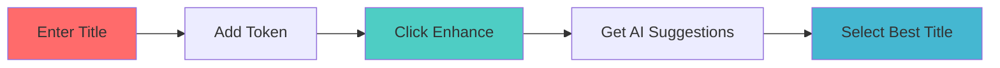

<div align="center">

# 🎬 Title Enhancer


### ✨ Transform Your Video Titles into Click-Worthy Masterpieces ✨

<p align="center">
  <em>Leverage cutting-edge AI technology to create engaging, optimized video titles that capture attention and drive engagement.</em>
</p>

<br/>

[](https://nextjs.org/)
[](https://reactjs.org/)
[](https://www.typescriptlang.org/)
[](https://tailwindcss.com/)
[](./LICENSE)

<br/>

[✨ Features](#-features) • 
[🚀 Quick Start](#-quick-start) • 
[💡 Usage](#-usage) • 
[🛠 Tech Stack](#-tech-stack) • 
[🎨 Screenshots](#-screenshots) • 
[🤝 Contributing](#-contributing)

<br/>

</div>

---

## 🌟 Why Title Enhancer?

<table>
<tr>
<td width="33%" align="center">
  <h3>🎯 Precision</h3>
  <p>AI-powered analysis ensures your titles hit the mark every time</p>
</td>
<td width="33%" align="center">
  <h3>⚡ Speed</h3>
  <p>Generate optimized titles in seconds, not hours</p>
</td>
<td width="33%" align="center">
  <h3>📈 Results</h3>
  <p>Increase engagement with data-driven title suggestions</p>
</td>
</tr>
</table>

---

## ✨ Features

<div align="center">

| Feature | Description |
|---------|-------------|
| 🤖 **AI-Powered Enhancement** | Leverage advanced AI algorithms to optimize video titles for maximum engagement |
| 🎨 **Modern UI/UX** | Beautiful, responsive design with dark mode support and smooth animations |
| ⚡ **Real-time Processing** | Instant title suggestions and analysis with zero lag |
| 🔐 **Secure Authentication** | Token-based API authentication for enterprise-grade security |
| 📊 **Analytics Ready** | Integrated with Vercel Analytics for performance monitoring |
| 🎯 **Customizable** | Tailored suggestions based on your unique content style |
| 📱 **Fully Responsive** | Seamless experience across all devices - mobile, tablet, and desktop |
| 🌙 **Dark Mode** | Eye-friendly dark theme for comfortable viewing |
| 🚀 **Lightning Fast** | Optimized performance with Next.js 16 and React 19 |

</div>

---

## 🎨 Screenshots

<div align="center">

### 💻 Desktop View
> Beautiful, intuitive interface designed for productivity

### 📱 Mobile View
> Fully responsive design that works flawlessly on any device

### 🌙 Dark Mode
> Eye-friendly dark theme for comfortable extended use

</div>

---

## 🚀 Quick Start

### Prerequisites

Before you begin, ensure you have the following installed:

- **Node.js** `18.0` or higher
- **npm**, **yarn**, or **pnpm** package manager

### Installation

```bash
# 1️⃣ Clone the repository
git clone https://github.com/yourusername/title-enhancer.git
cd title-enhancer

# 2️⃣ Install dependencies
npm install
# or
pnpm install
# or
yarn install

# 3️⃣ Set up environment variables
cp .env.example .env.local
# Edit .env.local with your API keys

# 4️⃣ Run the development server
npm run dev
# or
pnpm dev
# or
yarn dev

# 5️⃣ Open your browser
# Navigate to http://localhost:3000
```

<div align="center">

🎉 **That's it!** Your Title Enhancer is now running locally.

</div>

---

## 💡 Usage

### Basic Workflow

<div align="center">



</div>

1. **📝 Enter your video title** in the input field
2. **🔑 Add your authentication token** (if required)
3. **✨ Click "Enhance Title"** to generate AI-powered suggestions
4. **🎯 Select your favorite** enhanced title from the results
5. **📊 Track performance** with built-in analytics

### Advanced Features

- **📦 Batch Processing** - Process multiple titles simultaneously
- **🎨 Custom Styles** - Choose from different enhancement styles
- **📈 Analytics Dashboard** - Track which titles perform best
- **🔄 History** - Review and reuse previous enhancements
- **💾 Export** - Save your enhanced titles for later use

---

## 🛠 Tech Stack

<div align="center">

### Frontend Framework


### Styling


### UI Components


</div>

<details>
<summary><b>📚 Full Technology Stack</b></summary>

#### Core Technologies
- **[Next.js 16](https://nextjs.org/)** - React framework for production
- **[React 19](https://reactjs.org/)** - UI library with concurrent features
- **[TypeScript](https://www.typescriptlang.org/)** - Type-safe JavaScript
- **[Tailwind CSS 4](https://tailwindcss.com/)** - Utility-first CSS framework

#### UI Components & Libraries
- **[Radix UI](https://www.radix-ui.com/)** - Unstyled, accessible components
- **[shadcn/ui](https://ui.shadcn.com/)** - Re-usable component library
- **[Lucide React](https://lucide.dev/)** - Beautiful, consistent icons
- **[next-themes](https://github.com/pacocoursey/next-themes)** - Theme management

#### Development Tools
- **[PostCSS](https://postcss.org/)** - CSS transformations
- **[ESLint](https://eslint.org/)** - Code quality & consistency
- **[Vercel Analytics](https://vercel.com/analytics)** - Performance insights

</details>

---

## 📁 Project Structure

```
title-enhancer/
├── 📂 app/                    # Next.js app directory (App Router)
│   ├── 🎨 globals.css        # Global styles & theme variables
│   ├── 📄 layout.tsx         # Root layout component
│   └── 🏠 page.tsx           # Home page
├── 📂 components/            # React components
│   ├── 📂 ui/               # shadcn/ui components
│   │   ├── button.tsx
│   │   ├── card.tsx
│   │   ├── input.tsx
│   │   └── label.tsx
│   ├── 🎬 title-enhancer.tsx # Main feature component
│   ├── 🎥 video-card.tsx    # Video display component
│   └── 🌙 theme-provider.tsx # Dark mode management
├── 📂 lib/                   # Utility functions
│   └── ⚙️ utils.ts           # Helper utilities
├── 📂 public/               # Static assets
│   └── 🖼️ images & icons
└── 📄 Configuration files
    ├── package.json
    ├── tsconfig.json
    ├── tailwind.config.js
    └── next.config.mjs
```

---

## 🎨 Customization

### Theme Configuration

The app includes a sophisticated theming system with full dark mode support.

**Customize colors in `app/globals.css`:**

```css
:root {
  --background: oklch(0.13 0.01 250);
  --foreground: oklch(0.98 0 0);
  --primary: oklch(0.65 0.25 25);
  /* Add your custom colors */
}
```

### Component Styling

All components use Tailwind CSS utilities and can be easily customized:

```tsx
// Example: Custom button variant
<Button className="bg-gradient-to-r from-purple-500 to-pink-500">
  Custom Styled Button
</Button>
```

---

## 🤝 Contributing

We love contributions! Here's how you can help make Title Enhancer even better:

<div align="center">

### 🌟 Ways to Contribute

| Type | Description |
|------|-------------|
| 🐛 **Bug Reports** | Found a bug? Open an issue with details |
| ✨ **Feature Requests** | Have an idea? We'd love to hear it |
| 📝 **Documentation** | Improve our docs and help others |
| 💻 **Code** | Submit PRs to fix bugs or add features |

</div>

### Development Workflow

```bash
# 1. Fork the repository on GitHub

# 2. Clone your fork
git clone https://github.com/YOUR_USERNAME/title-enhancer.git

# 3. Create a feature branch
git checkout -b feature/AmazingFeature

# 4. Make your changes and commit
git commit -m '✨ Add some AmazingFeature'

# 5. Push to your branch
git push origin feature/AmazingFeature

# 6. Open a Pull Request
```

### Code Standards

- ✅ Follow the existing code style
- ✅ Write meaningful commit messages
- ✅ Add tests for new features
- ✅ Update documentation as needed
- ✅ Ensure all tests pass before submitting

---

## 📝 License

This project is licensed under the **MIT License** - see the [LICENSE](LICENSE) file for details.

<div align="center">

### 📜 MIT License Summary

```
Permission is hereby granted, free of charge, to use, copy, modify,
merge, publish, distribute, sublicense, and/or sell copies of the Software.
```

</div>

---

## 🙏 Acknowledgments

<div align="center">

Special thanks to these amazing projects and communities:

| Project | Description |
|---------|-------------|
| [shadcn/ui](https://ui.shadcn.com/) | Beautiful, accessible component library |
| [Radix UI](https://www.radix-ui.com/) | Unstyled, accessible primitives |
| [Lucide](https://lucide.dev/) | Gorgeous icon set |
| [Tailwind CSS](https://tailwindcss.com/) | Utility-first CSS framework |
| [Vercel](https://vercel.com/) | Deployment & analytics platform |
| [Replit](https://replit.com/) | Development & hosting environment |

</div>

---

## 📫 Contact & Support

<div align="center">

### Get in Touch

[](https://github.com/yourusername/title-enhancer)
[](https://twitter.com/yourusername)
[](https://discord.gg/yourinvite)

**Project Link:** [https://github.com/yourusername/title-enhancer](https://github.com/yourusername/title-enhancer)

</div>

---

<div align="center">

### 💖 Made with Love

**Built with cutting-edge technologies and a passion for great UX**


<br/><br/>

**[⬆ Back to Top](#-title-enhancer)**

<br/>

---

<sub>© 2024 Title Enhancer. All rights reserved.</sub>

</div>
